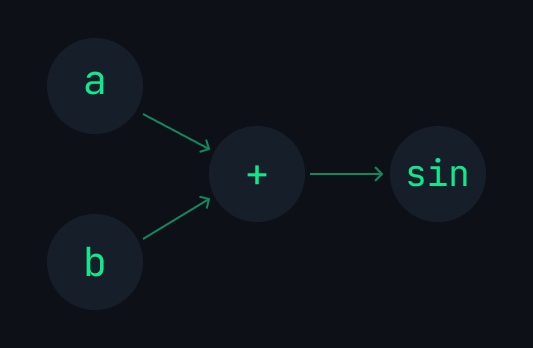
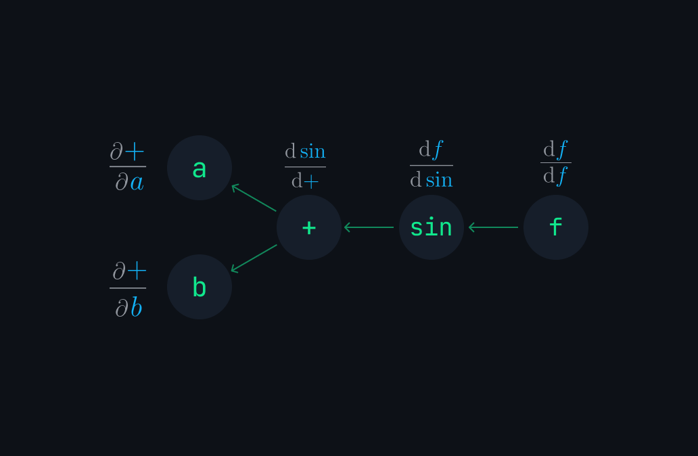

# Nodeflow Cpp
A simple and highly-extensible computational graph library written in C++.

## A sneak peak

<div align='center'>

</div>

## Installation 

1. Clone the project:

```bash
git clone https://github.com/sokmontrey/nodeflow.git
```

2. Link the library using CMake:

```cmake
add_subdirectory(nodeflow)
add_executable(main main.cpp)
target_link_libraries(main nodeflow)
```

3. Start coding:

```cpp
#include <nodeflow/nodeflow.h>
using namespace nodeflow;
//your code
```

## Simplicity with `Graph` class (High-level class)
### Creating a Function (Graph)
#### Simple Constant Function:

$$\sin(\frac{{\color{Orange} \pi}}{6})$$

```cpp
// create the function (graph)
Graph f ("sin(div(PI, 6))");

// evaluate sin(PI/6)
f.forward().print();
```

#### Multi-variables Function:

$${\color{Gray}f({\color{Emerald}a},{\color{Orange}b}) = \sin({\color{Emerald}a} + {\color{Orange}b})}$$

```cpp
Graph f ("sin(add(a, b))");
```

In case you are wondering, this create a graph that look something like this:



_I will be referring to $f$ as End node, $a$ and $b$ as Variable Node or Leaves Node (`f.getEnd()` or `f.getF()` to get the end node, $f$, from the graph `f` created above).

Give set node's value: ${\color{Emerald}a = 0.1}$,  ${\color{Orange}b = 0.25}$

```cpp
f.setNode("a", Node::Scalar(0.1 ))
 .setNode("b", Node::Scalar(0.25));
```

Call the function: ${\color{Gray}f({\color{Emerald}0.1},{\color{Orange}0.25})}$

```cpp
f.forward().print();
```

Some other way to update node value:

```cpp
// random scalar value 0-1
f.setNode("a", Node::Random()) 
// update node's value directly with eigen matrix
f.set("b", Eigen::MatrixXd::Constant(1,1,0.2))

// calculate sin(0.2 + 0.1)
f.forward().print();
```

### Automatic Differentiation:

**Taking** ${\color{Orange}\nabla}{\color{gray}f}$ (Backpropagation on the graph or gradient of the function):

```cpp
f.backward();
```

Nodeflow use reverse-mode automatic differentiation method to propagate back and calculate all the partial derivative with respect to every variable node.



(Sorry for abusing the syntax)

Chain rule:


and


#### Get $\partial f$  With respect to a variable

You can use `.getGrad` along with a node name to get the partial derivative of the function $f$ with respect to that specific node. 

$${\frac{\partial {f}}{\partial {\color{Emerald}a}}} and {\frac{\partial {f}}{\partial {\color{Orange}b}}}$$

```cpp
f.getGrad("a");
f.getGrad("b");
```

`.getGrad` return an `Eigen::MatrixXd`:

```cpp
std::cout << f.getGrad("a") << std::endl;
std::cout << f.getGrad("b") << std::endl;
```

#### Jacobian Matrices:
Currently, there is no high-level solution to get the Jacobian matrix from taking $\nabla f$. Nodeflow will try to backpropagate all the way from the **End node** to the **variable node** (a and b) and calculate all the partial derivatives. 

The graph should end with an operation that produce a **scalar**. If not, Nodeflow will pass in an all-one matrix with the same shape as the end node value as the outer derivative. This will collapse any Jacobian matrix and calculate the "pseudo" $\nabla f$.

#### To avoid taking derivative on constant:
Nodeflow will avoid calculating partial derivative for any part of the graph that are constant, in order to save some computations.

Use `#` in front of a node name in the expression to make it a constant node. 

```cpp
Graph f("relu(add(mul(w, #x), b))");
// You can also use .constant()
f.constant("b");
// Call .finished to re-configure the graph
f.finished();
```

See [Constant](#constant) for details.

>[!IMPORTANT] 
> Nodeflow can handle `.backward` for all sort of complex graph **as long as**
> 1. The graph is using properly defined [operators](#operator).
> 2. `f.finished()` is called correctly according to [The finished method](#the-finished-method).

### The finished method

`f.finished()` will re-config the graph to avoid any unnecessarily computation. It is also important for the graph to calculate `.backward` correctly.

Nodeflow automatically call `.finished()` when the graph is created. You can initialize node directly in the constructor.

```cpp
Graph f ("add(a, b)", {
	{"a", Node::Scalar(1)},
	{"b", Node::Scalar(1)} // Nodes shape already defined here
}); 

f.backward(); // no need to call .finished()
f.getGrad("a");
```

>[!NOTE]
>`.forward()` does not require `.finished`

If you use `.backward`, `.finished` should be called if:

1. The shape of Nodes is defined by using `.setNode()`, not from the `Graph` constructor.

```cpp
f.setNode("a", Node::Scalar(1));
f.setNode("b", Node::Scalar(1));
f.finished(); // <--
f.backward(); // then you can use .backward
```

2. The shape or dimension of any of the Node is changed, for example, from a scalar to a matrix or from a `2x2` matrix to `4x1`.

```cpp
//...
f.setNode("a", Node::Vector({1,2,3}))
f.setNode("b", Node::Vector({4,5,6}));
// the shape of both node a and b change from 1x1 to 3x1
f.finished();
f.backward();
```

3. If any of the Node changes from being a variable to a constant or vice versa.

```cpp
//...
f.constant("a");
f.finished(); // if .finished is not called, nodeflow will calculate all the partial derivative even for constant nodes.
f.backward();
```

### Vector and Matrix

Nodeflow cpp use `Eigen::MatrixXd` to store node's values. 0D, 1D, or 2D tensor will be represented as a matrix in a node by `Eigen::MatrixXd`.

All operators in Nodeflow support matrix right off the bat (mostly element-wise except matrix multiplication, "mul, dot, matmul"). 

>[!Note]
>Element-wise operation: operation on corresponding element (same row and col index. i.e. `a[i][j] + b[i][j]` for `0<=i<rows`, `0<=j<columns` and `a.rows == b.rows` and `a.cols == b.cols`) 

```cpp
Graph f ("mul(a, b)");

f.setNode("a", Node::Matrix({
	 {1, 2, 3},
	 {3, 4, 5}
}))
.setNode("b", Node::Vector({ 1, 2, 3 }))
.forward() // calculate matrix multiplcation a * b
.print();
```

### Sub-graph

A Nodeflow graph can take in other graphs as sub graphs and build up a larger graph.

Use `$` in front of a variable name in the expression to indicate that it is a sub graph. Then, you MUST pass in the sub graph into the constructor of the main graph using one of the three methods.
1. Pass in a map of pointers to sub graphs.
2. Pass in a map of references of sub graphs.
3. Pass in a map of pointers to **End Node** of sub graphs. (can be used directly with [Node or OperatorNode object](#lower-level)) 

Examples:

$${\color{Emerald}f(a) = \sin(a)}$$
$${\color{Orange}g(x)=\cos(x)}$$
$${h(x)=\mathrm{ReLU}(x)}$$
$$\Rightarrow h({\color{Orange}g({\color{Emerald}f(a)})}) = ReLU({\color{Orange}\cos({\color{Emerald}\sin(a)})})$$

```cpp
// sub sub graph
Graph f ("sin(a)"); 

// sub graph
Graph g ("cos($f)", {
	{"$f", f} // map of reference of Graph
});

// main graph
Graph h ("relu($any_name_you_want)", {
	{"$any_name_you_want", &g} // map of pointers to Graph
});

// setNode individually on sub graph
f.setNode("a", Node::Scalar(0.5)); 

// call .finished on the main graph to use .backward
h.finished()
 .backward();

// get partial derivative wrt a from f
f.getGrad("a");
```

>[!NOTE]
>If you want to initialize Node directly in the graph constructor, you can still do it. But the map of nodes has to be an argument before the map of sub graph.

### Constant

If a node is a constant, it does not mean that its value cannot be changed. 

You make a Node or a sub graph a constant to avoid finding partial derivative wrt to that node or graph.

Here is how you can create constants:

1. If a variable name is a number, Nodeflow will make a constant automatically. Example `add(3, a)` or `pow(a, 2)`. 3 and 2, respectively, are constants node on the graph.
2. If a variable or an operator name start with a `#`, it is a constant node. Example:
	1. `mul(#a, b)`: `f.getGrad("a")` is an empty matrix.
	2. `sin(#cos(θ))`: `f.getGrad("θ")` is also empty.
3. Use `.constant` on a Node, an OperatorNode, or a Graph to make it a constant.
4. You can also turn a sub graph into a constant directly in the expression by adding `#` before `$`. Example: `Graph g ("sin(#$f)")`

## Lower-level 
### Node
### Operator 
### Graph
