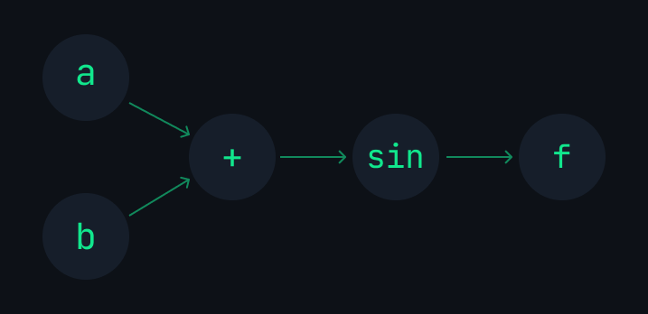

# Nodeflow Cpp
A simple and highly-extensible computational graph library written in C++.

## Installation 

1. Clone the project:

```bash
git clone https://github.com/sokmontrey/nodeflow.git
```

2. Link the library using CMake:

```cpp
add_subdirectory(nodeflow)
add_executable(main main.cpp)
target_link_libraries(main nodeflow)
```

3. Start coding:

```cpp
#include <nodeflow/nodeflow.h>
using namespace nodeflow;
//your code
```

## Simplicity with `Graph` class (High-level class)
### Creating a Function (Graph)
#### Simple Function:

$$\sin(\frac{{\color{Orange} \pi}}{6})$$

```cpp
// create the function (graph)
Graph f ("sin(div(PI, 6))");

// evaluate sin(PI/6)
f.forward().print();
```

#### Multi-variables Function:

$${\color{Gray}f({\color{Emerald}a},{\color{Orange}b}) = \sin({\color{Emerald}a} + {\color{Orange}b})}$$

```cpp
Graph f ("sin(add(a, b))");
```

In case you are wondering, this create a graph that look something like this:



Give set node's value: ${\color{Emerald}a = 0.1}$,  ${\color{Orange}b = 0.25}$

```cpp
f.setNode("a", Node::Scalar(0.1 ))
 .setNode("b", Node::Scalar(0.25));
```

Call the function: ${\color{Gray}f({\color{Emerald}0.1},{\color{Orange}0.25})}$

```cpp
f.forward().print();
```

Some other way to update node value:

```cpp
// random scalar value 0-1
f.setNode("a", Node::Random()) 
// update node's value directly with eigen matrix
f.set("b", Eigen::MatrixXd::Constant(1,1,0.2))

// calculate sin(0.2 + 0.1)
f.forward().print();
```

### Automatic Differentiation:

**Taking** ${\color{Orange}\nabla}{\color{gray}f}$ (Backpropagation on the graph or gradient of the function):

```cpp
f.backward();
```

Nodeflow use reverse-mode automatic differentiation method to propagate back and calculate all the partial derivative with respect to every variable node.


(Sorry for abusing the syntax)

Chain rule:


and


#### Get $\partial f$  With respect to a variable

You can use `.getGrad` along with a node name to get the partial derivative of the function $f$ with respect to that specific node. 

```cpp
f.getGrad("a");
f.getGrad("b");
```

$${\frac{\partial {f}}{\partial {\color{Orange}a}}}$$ and $${\frac{\partial {f}}{\partial {\color{Emerald}b}}}$$

`.getGrad` return an `Eigen::MatrixXd`:

```cpp
std::cout << f.getGrad("a") << std::endl;
std::cout << f.getGrad("b") << std::endl;
```

#### Jacobian Matrices:
There is no way to get the Jacobian matrix from taking $\nabla f$. Nodeflow will try to backpropagate all the way from the **end node** `f.getEnd()` or `f.getF()` to the **variable node** (a and b) and calculate all the partial derivatives. 

The graph should end with an operation that produce a **scalar**. If not, Nodeflow will pass in an all-one matrix with the same shape as the end node value as the outer derivative. This will collapse any Jacobian matrix and calculate the "pseudo" $\nabla f$.

#### To avoid taking derivative on constant:
Nodeflow will avoid calculating partial derivative for any part of the graph that are constant, in order to save some computations.

Use `#` in front of a node name in the expression to make it a constant node. 

```cpp
Graph f("relu(add(mul(w, #x), b))");
// You can also use .constant()
f.constant("b");
// Call .finished to re-configure the graph
f.finished();
```

See [Constant](#constant) for details.

>[!IMPORTANT] 
> Nodeflow can handle gradient for all sort of complex graph **as long as**
> 1. Operators used are defined 
> 2. `f.finished()` must be called to use `.backward()` when one of the following happened:
> 	- The shape of Nodes is defined by using `.setNode()`, not from the `Graph` constructor (see [example](#the-finished-method))
> 	- OR: The shape or dimension of any Node is changed, for example, from a scalar to a matrix or from a `2x2` matrix to `4x1`.
> 	- OR: If any node changes from being a variable to a constant or vice versa.

### The finished method

`f.finished()` will re-config the graph to avoid any unnecessarily performance. It is also important 

**Examples:**

Nodeflow automatically call `.finished()` when the graph is created. So if information about nodes is provided in the constructor,  you can immediately use `.backward()` without having to call `.forward()`:

```cpp
Graph f ("add(a, b)", {
	{"a", Node::Scalar(1)},
	{"b", Node::Scalar(1)}
}); 

f.backward(); // no need for .finished() nor .forward()

f.getGrad("a");
```

The `.forward()` must be called after any node changes its shape from one to another or has no shape initially but being defined later with `.setNode` or `.set`. Otherwise, Nodeflow will not be able to do `.backward` correctly, or potentially throw a run-time error.

```cpp
f.setNode("a", Node::Vector({1,2,3}))
 .setNode("b", Node::Vector({4,5,6}));
// the shape of both node a and b change from 1x1 to 3x1
f.forward(); //.forward() works fine
f.finished();
f.backward();
```

### Vector and Matrix:
Nodeflow cpp use `Eigen::MatrixXd` to store node's values. Any 0D, 1D, or 2D tensor will be represent as a matrix in a node by `Eigen::MatrixXd`.

All operators in Nodeflow support matrix right off the bat (mostly element-wise except matrix multiplication, "mul, dot, matmul"). 

>[!Note]
>Element-wise operation: operation on corresponding element (same row and col index. i.e. `a[i][j] + b[i][j]` for `0<=i<rows`, `0<=j<columns` and `a.rows == b.rows` and `a.cols == b.cols`) 

```cpp
Graph f ("mul(a, b)");

f.setNode("a", Node::Matrix({
	 {1, 2, 3},
	 {3, 4, 5}
}))
.setNode("b", Node::Vector({ 1, 2, 3 }))
.forward() // calculate matrix multiplcation a * b
.print();
```

### Constant

### Sub-graph

## Lower-level 
### Node, Operator, and Graph
